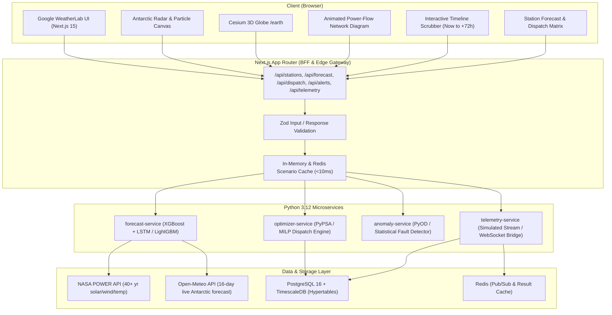

# Implementation Plan: PolarIs AI (Polar Energy AI Lab)

PolarIs AI is a predictive, optimization-driven, resilient energy-management platform for polar research stations (Maitri, Bharati, and Maitri II). It forecasts load and renewable generation from NASA POWER and Open-Meteo data, computes an optimal microgrid dispatch schedule (MILP) minimizing diesel consumption and battery degradation, detects operational anomalies, and triggers an automated "Polar Survival Mode" during extreme blizzards and polar-night conditions.

The user experience is an exact 100% faithful replication of **Google DeepMind WeatherLab** (`deepmind.google.com/science/weatherlab`) — combining Material Design 3 tokens, glassmorphic floating surfaces, buttery-smooth 60fps animations, an interactive Antarctic storm/irradiance canvas, animated power-flow network diagram, station forecast matrix, timeline scrubber, and 3D globe preview.

---

## 1. System Architecture



---

## 2. Directory Structure

```
polaris-ai/
├── apps/
│   └── web/                     # Next.js 15 app (BFF + full frontend)
│       ├── app/
│       │   ├── (dashboard)/
│       │   │   ├── page.tsx               # main console
│       │   │   ├── stations/[id]/page.tsx
│       │   │   ├── forecast/page.tsx
│       │   │   ├── dispatch/page.tsx
│       │   │   ├── survival-mode/page.tsx
│       │   │   ├── earth/page.tsx         # Cesium 3D preview
│       │   │   └── reports/page.tsx
│       │   └── api/                       # route handlers = public API
│       ├── components/
│       │   ├── ui/               # shadcn primitives, M3-themed
│       │   ├── glass/             # GlassPanel, GlassCard, GlassPill primitives
│       │   ├── dashboard/         # KPI cards, network diagram, timeline scrubber
│       │   └── earth/             # CesiumViewer, StationMarker, GlassHud
│       ├── lib/                   # api client, zod schemas, ws client
│       └── styles/tokens.css      # M3 + glass design tokens
├── services/
│   ├── forecast-service/          # FastAPI, Python
│   ├── optimizer-service/         # FastAPI, Python, PyPSA/SciPy MILP
│   ├── telemetry-service/         # FastAPI + MQTT ingestion
│   └── anomaly-service/           # FastAPI, PyOD/ADTK
├── packages/
│   ├── types/                     # shared zod schemas ↔ pydantic contracts
│   ├── ui/                        # design-system source of truth
│   └── data-pipeline/             # NASA POWER / Open-Meteo ETL
├── docs/
│   ├── adr/
│   └── IMPLEMENTATION_PLAN.md
├── docker-compose.yml
└── turbo.json
```
